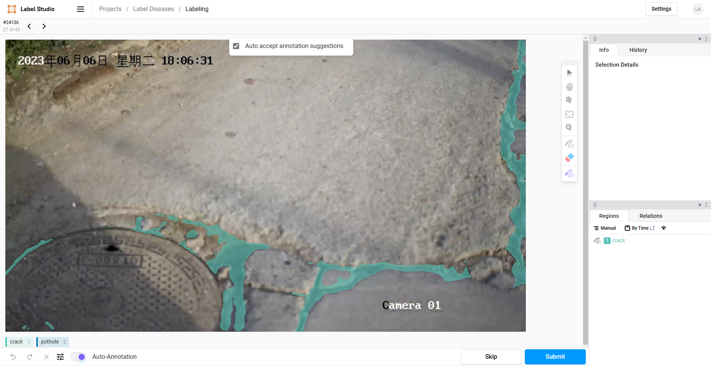
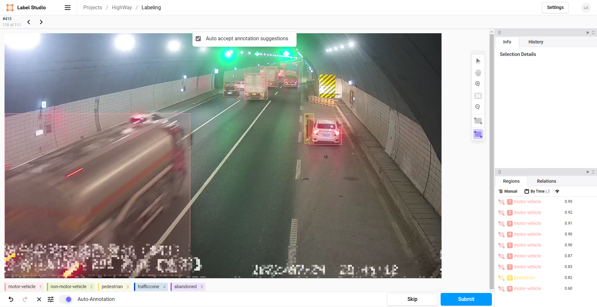

# label-studio-ml-backend-boilerplates

Utilizing Yolov5, Fastdeploy, and other technologies as the Machine Learning backend for Label Studio.

<table>
    <tr>
        <td>
            
            
FastDeploy Segmentation Backend.

        </td>
        <td>
            
            
YOLOv5 Detection Backend.

        </td>
    </tr>
</table>

----